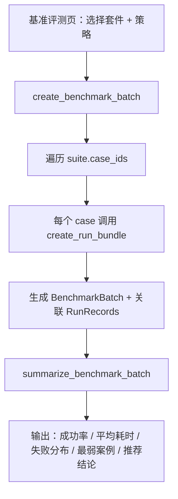

# 仿真机械臂任务验证平台 MVP — 产品需求文档（PRD）

> 文档版本 v2.0 · 2026-04-06
> 作者角色：具身智能产品经理

---

## 一、产品背景与问题定义

### 1.1 行业语境

具身智能（Embodied AI）正从实验室走向工程落地。在机器人"抓取—放置"（Pick & Place）这一最基础的操作原语上，算法团队通常面临一个被忽视的产品化缺口：

- **算法验证碎片化**：验证流程散布在 ROS 脚本、终端日志、离线 Jupyter 中，缺乏统一入口。
- **失败分析不可追**：任务失败后仅有原始日志，难以将"力反馈异常"等底层信号翻译为"夹爪闭合后目标物滑落"等可理解的产品语言。
- **策略迭代不可比**：同一任务在不同策略版本下的表现无法横向对比，导致"哪个版本更适合上线"这一业务决策缺乏数据支撑。
- **稳定性评估不可积**：单次 demo 无法反映策略在多场景下的通过率和失败分布，缺乏基准评测能力。

### 1.2 核心问题

**如何用最小工程成本，把机械臂抓取—放置任务的"验证 → 监控 → 复盘 → 比较 → 评测"闭环产品化表达出来？**

本项目不追求工业级控制精度，而是面向三类核心用户，以模拟数据驱动的方式构建一条完整的任务验证链路：

| 用户角色 | 核心诉求 | 关注页面 |
|---------|---------|---------|
| 算法工程师 | 策略是否更稳、失败发生在哪一阶段、两版效果是否可比较 | 任务工作台 · 版本对比 |
| 测试/实施工程师 | 任务是否可复现、失败是否可定位、过程是否可回放 | 任务工作台 · 基准评测 |
| 产品经理/面试官 | 链路是否清晰、结果是否可解释、演示是否顺畅 | 总览 · 任务工作台 |

---

## 二、产品定位与边界

### 2.1 产品定位

**单用户、本地运行、模拟数据驱动的具身智能任务验证仪表盘。**

它是一个面向求职作品集的产品原型，目标是证明候选人具备：
1. 从任务原语出发梳理验证流程并抽象为产品页面的能力
2. 将运行数据结构化沉淀、并转化为可解释结论的能力
3. 用 3D 动作视图增强失败复盘体验的工程实现能力
4. 在策略迭代中建立"可比较、可量化、可追溯"评估体系的产品思维

### 2.2 技术形态

| 层级 | 技术选型 | 职责 |
|------|---------|------|
| 产品界面层 | Python + Streamlit | 页面布局、导航状态、交互控件、数据编排 |
| 业务逻辑层 | Python dataclass + simulator | 数据模型、场景模拟、帧生成、状态投影、评测汇总 |
| 持久化层 | JSON 文件 (`data/store.json`) | 全量结构化数据的单文件读写 |
| 动作渲染层 | Three.js + TypeScript + Vite | 2.5D 机械臂场景渲染（独立 bundle，IIFE 注入） |
| 渲染降级层 | Python SVG 模板 | Three.js 不可用时的自动回退 |

### 2.3 明确不在范围

- 接入真实机械臂、ROS、Gazebo、Isaac 等真实控制/高保真仿真
- 多用户协作、账号体系、权限系统、线上部署
- 多任务编排、复杂场景地图、大规模参数管理
- 语音指令、OTA 升级、地图系统等与 MVP 价值无关的模块

---

## 三、信息架构与页面设计

### 3.1 导航结构

平台采用 4 页扁平导航：

```
总览 → 任务工作台 → 版本对比 → 基准评测
```

侧边栏提供角色视角切换（算法工程师 / 测试实施 / 产品经理 / 面试官），不同角色会获得不同的引导提示，但不影响功能权限。

### 3.2 页面职责矩阵

| 页面 | 核心职责 | 关键数据对象 | 布局风格 |
|------|---------|-------------|---------|
| **总览** | 平台入口，启动任务、查看 KPI、策略健康看板、最近运行列表 | `TaskTemplate` `StrategyVersion` `RunRecord` | 左 4 右 6 分栏，启动表单 + 实时预览 |
| **任务工作台** | 运行中：实时监控 + 暂停控制；已完成：详情/回放 Tab 切换 | `RunRecord` `RunEvent` `ReplayFrame` `ProjectedRunView` | 左 7 右 3 HUD 布局，3D 场景 + 指标时间线 |
| **版本对比** | 两次运行横向并排比较，输出差异说明和推荐结论 | `ComparisonSummary` | 左右对称两栏 |
| **基准评测** | 按评测套件批量生成运行，汇总成功率、耗时、失败分布 | `BenchmarkSuite` `BenchmarkBatch` | 指标卡 + 详情表格 |

### 3.3 总览页详细设计

```
┌─────────────────────────────────────────────────┐
│  指挥中心 Header（标题 + 角色引导语）              │
├──────────────────┬──────────────────────────────┤
│  启动任务表单     │  实时 3D 预览                  │
│  (2×2 网格)      │  (Three.js 动态场景)           │
│  · 任务模板      │                               │
│  · 策略版本      │                               │
│  · 预设场景      │                               │
│  · 操作员备注    │                               │
├──────────────────┴──────────────────────────────┤
│  KPI 指标栏  （总运行数 · 成功率 · 活跃任务 · 均耗时）│
├─────────────────────────────────────────────────┤
│  策略健康看板（3 列并行）                          │
│  每个策略版本：总运行 · 成功率 · 平均耗时 · 趋势     │
├─────────────────────────────────────────────────┤
│  ⚠️ 失败模式警告（近期高频失败原因）                │
├─────────────────────────────────────────────────┤
│  📋 最近验证任务（可折叠，卡片网格 + 对比勾选）      │
└─────────────────────────────────────────────────┘
```

#### 启动表单交互规则
- **预设场景**：`auto`（系统按策略自动选择）、`success`（标准成功）、`grasp_slip`（抓取失败）、`placement_offset`（放置偏移）
- **备注关键词解析**：系统通过 NLP 规则从备注中提取动态配置：
  - 节奏控制：`快节奏 → 1.35×`、`慢速讲解 → 0.70×`
  - 聚焦模式：`强调抓取`、`强调放置`、`强调失败`
- **实时预览**：右侧 3D 场景在表单参数变化时实时刷新，不写入持久化数据

### 3.4 任务工作台详细设计

#### 运行态（Live）

```
┌─────────────────────────────────────────────────┐
│  #### 实时任务状态                                │
├──────────────────────────┬──────────────────────┤
│  3D 动作场景 (480px)      │  状态徽章              │
│  ┌──────────────────┐    │  当前阶段              │
│  │ Three.js 渲染    │    │  进度 68%              │
│  │ · 机械臂关节动画  │    │  已用时 28s            │
│  │ · 夹爪开合        │    │  预计总时长 42s         │
│  │ · 物体抓取/释放   │    │                       │
│  └──────────────────┘    │  #### 执行时间线        │
│  ━━━━━━━━━━━━ 70%        │  ┌准备环境──────┐      │
│  运行状态：转运中         │  ├机械臂归位────┤      │
│                          │  ├接近目标──────┤      │
│  [暂停] 可使用暂停冻结...  │  ├执行抓取──────┤      │
│  ┌─运行摘要──────────┐   │  └转运中────────┘      │
│  │目标: 阀门盖  料仓: B1│   │                       │
│  │场景: 标准成功      │   │                       │
│  └───────────────────┘   │                       │
│  ℹ️ 页面每秒自动刷新      │                       │
├──────────────────────────┴──────────────────────┤
```

**关键交互规则：**
- 3D 场景使用 `@st.fragment` 隔离渲染，避免 `st.rerun()` 自动刷新时销毁 iframe
- 暂停按钮固定在 3D 场景下方进度条之后，不会随时间线增长而下移
- 暂停时冻结进度投影，总览页的实时预览同步冻结
- 物体位置逻辑：抓取前物体在料仓静止不动，夹爪闭合瞬间跳转到夹爪位置（snap 而非渐变）

#### 已完成态（Detail + Replay Tabs）

- **详情总览 Tab**：大标题显示"任务成功/失败" + 3D 终态静帧 + 结果摘要卡（紧凑双栏 Grid） + 运行指标 + 对比按钮
- **帧级回放 Tab**：滑块逐帧回放 + 3D 场景同步 + 回放摘要卡 + 事件时间线

---

## 四、核心任务模型

### 4.1 任务原语："抓取并放置验证"

当前平台固定为单一任务模板，聚焦于机械臂最基础的操作原语：

```
准备环境 → 机械臂归位 → 接近目标 → 对准目标 → 执行抓取 → 抬升目标 → 转运中 → 接近托盘 → 放置校验 → 回撤 → 任务完成
```

每个阶段都有对应的：
- **时间偏移量**（`offset_ms`）：决定该阶段在总时长中的位置
- **机械臂位姿**（`arm_pose: {x, y, z}`）：6 自由度简化为 3 轴坐标
- **夹爪状态**（`gripper_state: open | closed`）：控制抓取与释放
- **目标物状态**（`target_state: {held, placed, object_x, object_y}`）：跟踪物体是否被抓持、是否已放置

### 4.2 预设场景规格

| 场景 ID | 显示名称 | 最终状态 | 关键行为 | 质量分修正 |
|---------|---------|---------|---------|-----------|
| `success` | 标准成功 | `succeeded` | 全程平滑，物体落入托盘中心 | +0.08 |
| `grasp_slip` | 抓取失败 | `failed` | 夹爪闭合后力反馈波动，物体在抓取阶段滑落 | −0.25 |
| `placement_offset` | 放置偏移 | `failed` | 抓取和转运成功，但落点偏离托盘超过阈值 | −0.10 |

### 4.3 策略版本设计

| 策略 ID | 显示名称 | 默认节奏 | 设计意图 |
|---------|---------|---------|---------|
| `heuristic-baseline` | 规则阈值基线策略 | 默认 (1.0×) | 基于规则的基线，在简单场景稳定但在边缘条件易失败 |
| `stable-policy` | 稳定抓取补偿策略 | 慢速 (0.70×) | 加入力控补偿的改进策略，以牺牲速度换取稳定性 |
| `fast-motion` | 高速节拍转运策略 | 快速 (1.35×) | 追求节拍效率的策略，在严格容差下易出现放置偏移 |

**策略与场景的交叉映射**（`auto` 模式下系统自动选择场景）：

| 场景 | heuristic-baseline | stable-policy | fast-motion |
|------|-------------------|---------------|-------------|
| 标准抓取 | ✅ success | ✅ success | ✅ success |
| 低抓取裕量 | ❌ grasp_slip | ✅ success | ❌ grasp_slip |
| 严格放置容差 | ❌ placement_offset | ✅ success | ❌ placement_offset |
| 遮挡接近 | ❌ grasp_slip | ✅ success | ❌ placement_offset |
| 快速节拍 | ✅ success | ✅ success | ✅ success |

> 这张交叉表是整个评测体系的核心：它既定义了"策略在哪些场景下会失败"，也为面试演示提供了可控的叙事素材。

---

## 五、数据架构

### 5.1 领域模型

```
TaskTemplate ──1:N──→ RunRecord ──1:N──→ RunEvent
     │                    │                  
     │                    ├──1:N──→ ReplayFrame
     │                    │
StrategyVersion ──1:N──→ RunRecord
                          │
                    RunResult (嵌入)
                          │
BenchmarkSuite ──1:N──→ BenchmarkBatch ──N:M──→ RunRecord
```

### 5.2 核心数据对象

| 对象 | 字段数 | 核心职责 |
|------|-------|---------|
| `TaskTemplate` | 5 | 定义任务名称、描述、步骤序列和成功标准 |
| `StrategyVersion` | 5 | 定义策略名称、版本号、说明和创建时间 |
| `RunRecord` | 10 | 单次运行主记录：时间、耗时、输入参数、标签、结果 |
| `RunResult` | 8 | 运行结论：成功/失败、质量分、关键观察、失败原因、场景标签 |
| `RunEvent` | 6 | 过程关键事件：阶段、级别、消息、时间偏移 |
| `ReplayFrame` | 7 | 回放帧：位姿、夹爪状态、目标物状态、阶段 |
| `BenchmarkSuite` | 5 | 评测套件：用例集合 + 关注指标 |
| `BenchmarkBatch` | 7 | 评测批次：关联策略、套件和运行 ID 集合 |
| `ProjectedRunView` | 7 | 运行时投影：基于当前时间计算可见事件/帧/进度（派生，非持久化）|
| `ComparisonSummary` | 8 | 对比结果：差异说明 + 推荐结论（派生，非持久化）|

### 5.3 持久化策略

- 全量数据存储在 `data/store.json` 单文件中
- 首次运行自动初始化种子数据：1 个任务模板、3 个策略版本、2 个评测套件、10 条示例运行记录
- 读写通过 `JsonStore` 统一封装，未来替换为数据库只需替换该层

---

## 六、渲染架构：从位姿数据到 3D 动作视图

### 6.1 渲染管线

```
Python simulator       Python renderer.py        Browser
─────────────────     ──────────────────        ──────────────
build_renderer_payload()                        
  → RendererPayload   → JSON 序列化              
                       → st.components.html 注入  
                                                → window.RobotRenderer.render()
                                                → Three.js 场景创建
                                                → 动画循环 + 帧采样
                                                → 机械臂/夹爪/物体/镜头更新
```

### 6.2 Payload 协议

`RendererPayload` 是 Python 与前端之间的唯一契约，包含：

- `view_mode`：页面视图类型（detail / replay / overview / compare）
- `animation_mode`：动画模式（live / static / loop）
- `dynamic_profile`：节奏倍速和聚焦模式
- `scene`：物体标签、料仓位、托盘位
- `frames[]`：全量回放帧序列
- `events[]`：全量事件序列
- `total_duration_ms` / `initial_elapsed_ms`：动画时间轴参数

### 6.3 帧间插值规则

| 场景 | 插值策略 |
|------|---------|
| 两帧均为"已抓持" (`held: true`) | 线性插值物体坐标 |
| 两帧均为"未抓持" (`held: false`) | 物体保持前一帧位置不动 |
| 抓取/释放过渡帧 | **snap 跳转**：`ratio < 0.5` 取前帧坐标，`ratio ≥ 0.5` 跳转到后帧坐标 |

> snap 规则确保物体不会在抓取前"飘向"机械臂，视觉表现为：物体静止在料仓 → 夹爪闭合瞬间 → 物体跟随手臂。

### 6.4 渲染降级策略

当 `web/robot_renderer/dist/renderer.js` 不存在或浏览器渲染失败时，系统自动降级为 Python 生成的 SVG 视图，保证核心功能不受影响。

---

## 七、核心流程

### 7.1 启动 → 监控 → 结论 主流程

```mermaid
flowchart TD
    A[总览页：选择策略 + 场景 + 备注] --> B[实时预览确认]
    B --> C[点击"开始验证"]
    C --> D[JsonStore.create_live_run]
    D --> E[simulator 生成 RunRecord + Events + Frames]
    E --> F[任务工作台 · 实时监控]
    F --> G{任务到达结束时间?}
    G -->|否| H[每秒刷新 + 投影当前状态]
    H --> F
    G -->|是| I[sync_run_statuses → 最终状态]
    I --> J[任务工作台 · 详情/回放 Tabs]
    J --> K[可选：版本对比 / 基准评测]
```

### 7.2 基准评测流程



### 7.3 版本对比逻辑

推荐规则透明且可解释：
1. **成功优先**：一方成功另一方失败 → 推荐成功方
2. **耗时优先**：都成功 → 推荐耗时更短方
3. **失败推后优先**：都失败 → 推荐失败发生更靠后的一方（走得更远 = 表现更好）

---

## 八、运行状态机

```
queued → running → succeeded
                 → failed
                 → cancelled
```

- `queued`：任务已创建但尚未开始
- `running`：任务正在执行（基于时间投影）
- `succeeded`：全阶段完成，物体成功放入托盘
- `failed`：执行过程中出现夹爪滑落 / 放置偏移等异常
- `cancelled`：手动取消（保留已生成的事件和帧用于调试）

---

## 九、非功能需求

| 维度 | 要求 |
|------|------|
| 可运行性 | 本地单机可运行，不依赖 GPU、真实机器人或复杂中间件 |
| 搭建成本 | 首次搭建 ≤ 半天，`pip install + streamlit run` 即启动 |
| 交互效率 | 核心操作 ≤ 3 次点击完成 |
| 实时性 | 运行态页面秒级自动刷新，3D 场景不因刷新闪烁 |
| 可解释性 | 失败场景必须可见、可解释、可回放 |
| 自包含性 | 首次运行自动初始化种子数据，开箱即演示 |
| 演示适配 | 适合录屏、现场讲解和求职展示 |

---

## 十、测试策略

### 10.1 测试原则

- 测试验证外部行为，不绑定 UI 细节
- 重点覆盖"数据能否正确生成""状态是否一致""推荐结论是否合理"
- Python 与 TypeScript 分别覆盖各自责任域

### 10.2 自动化测试覆盖

| 测试域 | 框架 | 已覆盖项 | 重点行为 |
|-------|------|---------|---------|
| Python 业务逻辑 | unittest | 17 项全通过 | 种子数据完整性、运行生成、状态投影、评测汇总、对比推荐、JSON 存储读写 |
| 前端渲染协议 | Vitest | 5 项全通过 | 动画时间计算、帧采样插值、物体 snap 验证、标签→几何映射 |

### 10.3 手工验收清单

- [ ] 标准成功场景：启动 → 监控 → 成功结论 → 回放
- [ ] 抓取失败场景：物体在抓取阶段滑落，结论明确指出失败原因
- [ ] 放置偏移场景：转运成功但落点偏移，结论包含偏移说明
- [ ] 版本对比：选择两次运行，推荐结论符合透明规则
- [ ] 基准评测：执行一轮套件，汇总数据完整且最弱案例正确
- [ ] 暂停控制：运行中点击暂停，页面冻结；点击继续，恢复刷新
- [ ] 渲染降级：删除 `renderer.js` 后页面自动回退为 SVG 视图

---

## 十一、成功指标

| 指标 | 目标 |
|------|------|
| 链路可理解性 | 面试官/非研发用户能在 3 分钟内看懂完整任务验证链路 |
| 操作门槛 | 不需要打开命令行就能完成一次标准演示 |
| 失败可解释性 | 至少覆盖两类失败原因，并能在结果页和回放页中讲清楚 |
| 表达一致性 | README、PRD、页面文案和演示流程的表达保持一致 |
| 评测可量化性 | 基准评测输出成功率、平均耗时和最弱案例等量化指标 |

---

## 十二、实现优先级

| 优先级 | 范围 | 状态 |
|--------|------|------|
| **P0** | 总览入口 + 启动任务 + 实时监控 + 基础数据模型 | ✅ 已完成 |
| **P1** | 结果报告 + 帧级回放 + 失败场景可解释 | ✅ 已完成 |
| **P2** | 版本对比 + 基准评测 + 策略健康看板 | ✅ 已完成 |
| **P3** | Three.js 3D 渲染 + HUD 布局 + 暂停控制 + 动态备注解析 | ✅ 已完成 |
| **P4** | 视觉细节打磨 + 文档治理 + 演示脚本优化 | 🔄 进行中 |

---

## 十三、附录：演示推荐顺序

1. **总览页开场**：介绍平台定位、三类用户、策略版本和近期运行结果
2. **启动"标准成功"**：在 3D 场景中实时观察机械臂完成完整抓取—放置流程
3. **启动"抓取失败"**：切换到失败场景，展示力反馈异常导致物体滑落
4. **回放失败过程**：用帧级回放定位失败发生的精确时刻
5. **版本对比**：选取两次不同策略的运行，展示推荐逻辑
6. **基准评测**：对"稳定抓取补偿策略"跑一轮评测套件，证明其在 5 个场景中全部通过

> 整套演示控制在 5–8 分钟内，覆盖"启动 → 成功 → 失败 → 复盘 → 对比 → 评测"完整链路。
