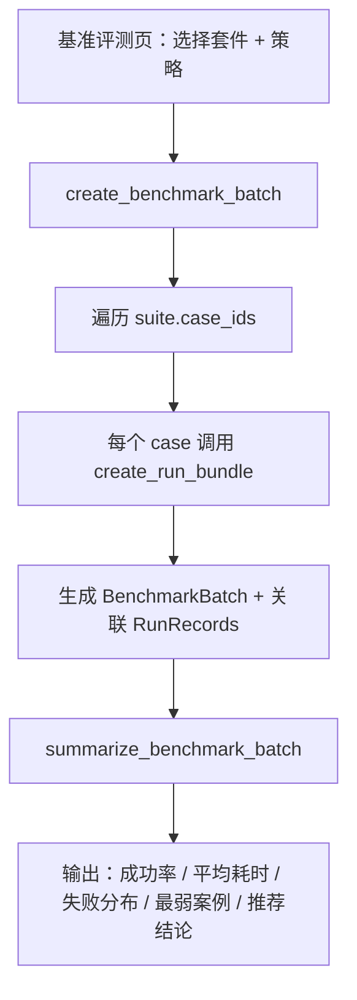

# 仿真机械臂任务验证平台 MVP — 产品需求文档（PRD）

> V1 文档基线 v2.1 · V2 机械臂增量实施基线 v1.2 · 2026-09-22
> 作者角色：具身智能产品经理

> 本文是当前产品基线。它描述产品要解决的问题、用户得到的结果、MVP 的范围、核心规则和验收口径；系统模块、运行数据和跨模块协议分别见 [docs/系统架构.md](docs/系统架构.md) 与 [docs/接口与数据契约.md](docs/接口与数据契约.md)。

### 基线维护说明

- 当前已实现版本包括 V1 演示基线、V2 历史平面任务和 V2.8D 的 Panda 机械臂与夹爪接入。
- 当前实现状态：单方块接触抓放、同源完整几何回放、同模型比较和相关恢复经独立 Q4 限定通过，见 [交付审查](docs/Panda-Q4交付审查.md#handoff-panda-q4-review-02)。这不是完整 V2 商业/生产放行或真机能力证明。
- 产品事实来源：本 PRD 描述用户和业务规则；代码行为以 `app.py`、`robot_mvp/` 和测试为准；V1 数据为 `data/store.json`，V2 物理运行事实为 `data/v2_runs/<run_id>/`。
- 迭代要求：新增页面、运行状态、数据字段或渲染协议时，必须同步更新本 PRD、架构文档、接口契约和相关验收项。

---

## V2 需求与增量规划

> 本节是基于 2026-09 的外部调研、项目目标和本机约束形成的 V2 实施基线。它定义第一阶段要交付的最小产品工程切片；多任务、多机器人、VLA 和大规模数据属于后续扩展，不是当前验收条件。

> 2026-09-21 目标更新：用户明确以求职作品集证明具身智能行业的上手能力。优先从希望展示的能力倒推代表性任务和完成证据；访谈与市场验证不作为实施前置条件。本轮已授权进入方案、工程实施和验收。

> 2026-09-22 本轮结果：用户授权按完整计划实施后，Panda 增量已完成，并获得独立 Q4 限定通过。新增物理、几何、页面和资源证据单独保留，不使用旧平面位置示意的通过结论替代。

### V2.1 方向判断

V2 做一个面向求职展示的机器人软件平台能力切片：用一个真实物理仿真任务产生运行数据，再由现有工作台完成实时状态展示、回放、版本比较和报告输出。项目不覆盖整机硬件、复杂场景解决方案、模型训练平台和通用机器人操作系统。

候选产品定位：

> 通过一个可运行的机器人仿真验证切片，证明候选人能够接入具身智能执行环境，组织运行数据，比较两个策略版本，并形成可复查的验证结论。

当前产品承诺只到“支持在明确仿真条件下进行受控验证”，不承诺判断策略能否直接上线，也不把仿真结果等同于真实机器人表现。

### V2.1A 已确认的项目目的与评价方式

首要目的：通过一个可运行、可复查、可讲解的代表性项目，展示计算机背景的候选人理解具身智能任务、组织产品流程、接入外部系统和判断结果的能力。无需以发现新的商业空白或获得付费客户作为项目成立条件。

招聘方和技术面试官是作品评价者；机械臂任务验证人员是候选产品流程中的代表性使用者。两者不能混为一类产品用户。作品应围绕明确任务设计，公开资料和自设情境可以作为起点，并如实注明来源。

| 希望展示的能力 | 可检查的作品证据 | 掌握程度检查建议 |
|---|---|---|
| 领域理解 | 说明观测、动作、单次运行、成功判定及仿真边界 | 解释一个运行为何结束却未成功 |
| 产品判断 | 代表性使用者、任务、流程、范围和验收规则 | 解释为什么先做版本比较，以及什么情况下不应给出推荐 |
| 技术接入 | 一条实际执行到工作台展示的完整记录 | 解释数据来自哪里、转换做了什么、依赖如何影响结果 |
| 评测判断 | 条件可追溯的两版比较及失败证据 | 面对局部退化，指出证据与下一步检查 |
| 交付表达 | 可运行说明、交互演示、带依据的报告和已知限制 | 分别向技术人员和非研发人员解释同一结果 |

以上是建议的项目验收框架，不是招聘效果保证。一个作品可以提供与岗位相关的能力证据，但不能单独证明已具备现场交付、生产运维或所有具身岗位能力。

### V2.2 背景与问题假设

V1 已经把任务启动、过程展示、失败回放、策略对比和批量汇总组织成一个模拟流程。V2 需要补上真实执行数据和产品工程接入证据：

1. V1 的运行结果由模拟器预设，不能证明平台能接入实际仿真执行链路。
2. V1 的回放、比较和报告能力还没有面对真实状态轨迹、事件和结束条件。
3. 项目需要用一个小而完整的仿真切片，证明从执行、记录到平台展示可以接通。
4. 失败报告必须区分观察事实、失败分类、可能原因和未知项，避免把演示文案当成实验结论。

以上内容是需求假设，不能写成已验证的企业痛点。当前可依据公开工作流构建代表性任务，说明原始输入、判断步骤、已有工具和预期输出；人工成本未知时不填造数值。后续访谈用于校准，当前以任务合理性、实际运行和决策可复查作为作品验收依据。

### V2.3 目标用户与任务

| 用户 | 定位 | V2 任务 | 主要交付物 |
|---|---|---|---|
| 机械臂任务验证人员 | 主要用户假设，可能来自算法、测试或科研实验团队 | 设置受控条件、运行任务、检查结果、定位退化、复查证据 | 可复查的验证结论 |
| 算法工程师 | 次要用户 | 查看策略版本差异、失败阶段和分场景退化 | 策略改进线索 |
| 售前/解决方案工程师 | 结果使用者和演示用户 | 将客户任务转成可运行的验证配置，展示限制和结果 | 技术验证报告或演示结果 |

“机械臂任务验证人员”是候选场景角色，尚非已确认的商业目标用户。访谈可在有条件时进行，人数不作为作品完成门槛。研究生或开源使用者的反馈只支持其实际参与场景。

需求证据暂沿用以下项目内部分类，仅用于限定结论来源，不是通用研究等级，也不用于给作品质量或候选人能力评分：

| 证据等级 | 获取方式 | 可以支持的结论 |
|---|---|---|
| A | 直接访谈企业测试、算法或部署人员，并记录最近一次真实验证流程 | 可以讨论目标用户的实际流程和痛点 |
| B | 访谈机器人方向研究生、实验室成员或开源项目使用者，并限定为科研/实验验证场景 | 可以讨论相近场景的任务和成本，不能外推企业需求 |
| C | 基于公开产品/岗位/开源资料，自己重建一次验证流程，并请技术人员异步评审 | 可以形成需求假设和产品设计依据，不能声称完成用户验证 |
| D | 只有自我推演和模拟数据 | 只能支持作品集原型探索，不能支持市场需求结论 |

没有访谈时，公开资料、自设任务和实际运行记录可以支撑能力展示；分别注明来源即可。实际执行仍是技术接入能力的必要证据，预设结果不能替代。获得任何外部反馈后都可修订设计，无需等待某一证据等级；任何一类材料单独都不能证明市场普遍需求。

### V2.4 核心用户任务

用户修改一版策略或参数后，可以：

1. 选择任务、场景、策略版本和受控参数；
2. 使用物理仿真执行至少一条真实运行；
3. 保存运行配置、环境版本、初始状态、逐步状态和关键事件；
4. 查看任务是否成功以及对应证据；
5. 回放失败运行，区分观察、失败分类、可能原因和未知项；
6. 在相同条件下比较两个策略版本；
7. 查看总体结果和分场景结果；
8. 在证据不足时得到“需要补测”，而不是被迫得到一个确定推荐；
9. 输出一份可供算法、测试或客户复查的验证报告。

### V2.5 MVP 范围

V2 的最小范围为：

- 一台机械臂；
- 一类物体；
- 一个抓取并放置任务；现有为平面任务，新增目标为同源机械臂与夹爪的接触抓放；
- 两版脚本策略或同一控制逻辑下的两个参数版本；
- 一个正常条件和一个受控扰动条件；
- 仿真执行过程中展示当前阶段、状态和进度；
- 保存运行记录并导入现有工作台；
- 支持单次回放、两版比较和结果报告。

第一条验收链路只要求跑通一个 episode；完成演示时建议每个版本运行少量重复 episode，并报告实际样本量。候选版本不必胜出，能够识别退化或证据不足同样体现评测判断。

当前执行基础为原生 MuJoCo。完整机械臂增量首选复用 Menagerie Panda 模型，须先完成本机模型与控制验证；robosuite 不作为当前前置依赖。不要求 NVIDIA CUDA，不下载大型多任务数据集。

### V2.5A 数据来源策略

V2 第一阶段采用“开源环境与资产 + 自行生成运行数据”的方式：

| 数据类型 | 来源 | 用途 |
|---|---|---|
| 仿真环境、机械臂模型、物体资产 | MuJoCo、robosuite 或其他明确许可的开源项目 | 提供任务执行环境 |
| 任务配置和初始状态 | 项目自定义，并记录随机种子和状态快照 | 保证两版策略在相同条件下比较 |
| 动作、状态、事件和成功结果 | 本项目运行仿真后自行生成 | 作为平台回放、比较和报告的事实来源 |
| 视频或渲染帧 | 本项目运行时自行生成 | 作为失败复盘的可视证据 |
| 外部示范数据集 | V2 第一阶段不作为前置依赖 | 后续需要展示数据导入或 VLA 时再接入 |

每条运行记录必须保留环境名称和版本、资产来源、许可证信息、策略版本、参数、初始状态、运行配置和原始产物位置。外部项目提供的是执行基础，不应被描述成项目自行采集的数据；自行生成的仿真运行也只能支持对应仿真条件下的结论。

采用自行生成数据的原因是：V2 要证明的是运行接入、数据组织、受控比较和结果解释能力，而不是证明能够下载或管理大型机器人数据集。相同初始状态下只改变一个策略参数，才能让版本比较具有清晰的因果边界。

### V2.6 受控比较规则

| 问题 | V2 规则 |
|---|---|
| 怎样算成功 | 测试前定义目标区域、释放条件、稳定保持时间和超时阈值；任务结束状态不直接等于成功 |
| 两版是否可比 | 使用同一组初始状态、相同场景、相同指标定义，并明确唯一改动 |
| 失败发生了什么 | 记录阶段、时间窗口和状态证据；允许原因未知 |
| 总体变好是否掩盖局部退化 | 同时展示总体结果、分场景结果、超时、执行异常和失败类型 |
| 数据是否足够支持结论 | 展示样本量、适用仿真条件和证据范围；不足时输出“证据不足，需要补测” |

运行记录至少应保存：策略版本和参数、场景配置、初始状态、随机种子、环境版本、运行架构、逐步状态、关键事件、结束状态、成功判定和原始产物位置。随机种子不作为精确复现的唯一条件。

失败结论必须分层：

> 观察：夹爪闭合后，物体没有离开桌面。
> 分类：抓取阶段未成功。
> 可能原因：抓取位置偏移，需要进一步验证。

报告不能只依据一条记录确认控制器或传感器故障。

### V2.7 产品有效性验收

策略评测和产品验证分别验收。

策略评测关注任务执行表现：

- 成功率；
- 失败类型；
- 失败阶段；
- 任务耗时；
- 分场景结果；
- 样本量和仿真适用范围。

产品验证关注用户能否完成验证工作：

让使用者拿一组未提前演示过的数据，独立完成“找出候选版本发生退化的场景、定位一条证据、写出下一步需要验证什么”。与原有处理方式比较：

- 结论是否正确；
- 完成时间；
- 求助次数；
- 操作障碍；
- 是否能复查他人的结论。

少量试用只能形成观察结果，不能直接写成普遍效率提升。

没有外部试用者时，可先做作者自测或请技术同学走查：检查能否从一份未提前分析的运行数据找到差异、定位证据并形成报告。作者熟悉界面、重复同一案例的记忆效应都会影响耗时，因此自测不作为效率提升或目标用户验证的证据。自测发现的问题及修改可用于展示迭代判断；独立用户试用是后续增强证据。

### V2.7A 测试工程师任务与测试案例

测试工程师在 V2 中不是“最后点击一下验收按钮”的角色，而是使用平台完成验证工作的代表性角色。其基本任务是选择策略和初始条件、发起仿真、检查运行产物、查看成功判定、回放失败、比较两个版本、判断证据是否充分，并记录问题和回归结果。

后端实现前先定义以下最小测试案例：

| 编号 | 测试案例 | 前置条件 | 预期结果 |
|---|---|---|---|
| TC-01 | 正常抓取放置 | 有效任务、有效策略和有效初始状态 | worker 正常完成，产物完整，成功判定可解释，平台可回放 |
| TC-02 | 受控失败 | 只修改一个会导致滑落或偏移的参数 | 运行标记为失败，记录失败阶段和证据，不伪造成功 |
| TC-03 | worker 异常或超时 | 仿真进程主动退出或超过时限 | 平台显示 failed/timeout，保留错误信息，页面不被阻塞 |
| TC-04 | 两版受控比较 | 两次运行使用同一初始状态和场景 | 平台展示参数差异、结果差异、样本量和证据范围 |
| TC-05 | 运行产物回放 | 已完成运行存在轨迹和事件 | 回放读取真实轨迹，不能退回 V1 预设 snap 数据 |

每个测试案例必须记录输入、前置条件、操作步骤、预期结果、实际结果、运行产物、失败分类和回归状态。测试失败后先判断问题属于环境、策略、worker、数据契约、平台展示还是成功判定，再决定修改位置。

V2 的后端迭代循环为：执行测试案例 → 记录失败证据 → 分类问题归属 → 修改最小范围 → 重跑失败案例 → 重跑相关回归案例 → 更新测试案例和已知限制。

### V2.8 实施顺序

能力目标与代表性任务定义 → 测试案例和验收契约 → 仿真环境 Spike → 后端 worker → 运行记录接入 → 两版策略比较 → 失败复盘与回归 → 整理作品。访谈和独立用户反馈有条件时并行补充，不作为这条路径的硬门槛。

### V2.8A 技术执行契约

V2 的实时含义是“平台可观察后台 worker 的运行状态”，不是在 Streamlit 页面进程内高频步进物理仿真：

- `robot_mvp.v2_worker` 独立进程负责加载 MuJoCo 模型、步进环境和写入运行产物；页面或 CLI 只能启动、轮询和读取结果。
- 每次运行独立写入 `data/v2_runs/<run_id>/`：`config.json`、`meta.json`、`status.json`、`trajectory.jsonl`、`events.jsonl`、`summary.json`；不得把 V2 轨迹追加到 V1 `data/store.json`。
- `meta.json` 是环境、策略、初始状态和复现边界的事实来源；`trajectory.jsonl` 是回放事实来源；`summary.json` 只保存基于轨迹计算的结果和分层失败说明。
- `status.json` 允许 `queued → running → succeeded/failed`；worker 崩溃和超时由父进程转换为结构化失败，不能让页面等待或静默成功。
- 首阶段使用原生 MuJoCo 的轻量平面抓放任务作为可运行基线。robosuite 不是当前运行前置依赖；后续接入必须复用同一产物契约并重新验证安装和渲染边界。
- 现有 renderer 只能通过 `robot_mvp.v2_adapter.artifact_to_renderer_payload()` 消费 V2 轨迹；payload 必须标明 `trajectory_source=mujoco-runtime` 和 `coordinate_system=mujoco-world`，不能把 V1 的 snap 帧当成物理证据。

最小运行入口：

```bash
python -m robot_mvp.v2_cli run --artifacts data/v2_runs --strategy baseline
python -m robot_mvp.v2_cli run --artifacts data/v2_runs --strategy offset-grasp --grasp-offset 0.08
python -m robot_mvp.v2_cli compare data/v2_runs/<run-a> data/v2_runs/<run-b>
```

### V2.8B 当前执行任务与完成条件

以下 T1～T6 属于已有平面任务基线；本次完整机械臂增量按 V2.8D 及其执行计划推进，不将旧任务勾选状态继承为新模型完成。

| 任务 | 交付物 | 完成条件 |
|---|---|---|
| T1 仿真 Spike | 原生 MuJoCo 模型与依赖说明 | Windows + Python 3.12 CPU 可运行一条 episode |
| T2 worker 与产物 | 独立 worker、状态轮询、运行目录 | 页面进程不执行物理循环；正常、异常、超时均可观察 |
| T3 运行记录接入 | V2 adapter 和轨迹 payload | 回放使用 `trajectory.jsonl`，不读取 V1 snap 数据 |
| T4 受控比较 | compare CLI/report | 相同初始状态、唯一参数差异、证据不足可输出 |
| T5 验收回归 | TC-01～TC-05 自动化入口 | Python 测试通过，5 个 V2 案例各有结果证据 |
| T6 平台页面接入 | Streamlit V2 运行页 | 可从页面启动/轮询/查看 artifact；未完成前不宣称 V2 UI 已交付 |

### V2.8C 可视化验收契约

V2 的可视化是运行事实的只读解释层：后端产生轨迹、事件和报告，前端负责坐标转换、时间采样、播放控制和状态呈现。V2 payload 必须使用 `coordinate_system=mujoco-world`；前端不得用 V1 的 snap、弧线或失败抖动替代真实轨迹。

最小页面由主空间视图、运行状态、结构化报告和播放/时间位置组成。baseline 必须能看出物体随工具移动并完成放置；offset-grasp 必须能看出物体未建立抓取约束；两者的页面结论必须与 `summary.json` 一致。多视角、点云、摄像头、多机器人和复杂 3D 编辑不属于当前视觉验收。

以上基于抓取约束的描述仅适用于现有平面任务。Panda 增量按下节接触抓取和完整几何一致性验收，不沿用粘连抓取判据。

### V2.8D 完整机械臂与夹爪增量需求

**问题**：现有 V2 只显示工具位置点、物体与目标，后端也是简化平移机构。它证明数据可回放，不能让用户看到完整机械臂如何抓取，也不足以说明夹爪与物体的实际关系。

**本次目标**：在现有页面运行一台机械臂与双指夹爪的单方块抓放任务，回放与后端同源的完整几何和状态，并解释成功或失败。已接入固定版本 Menagerie Panda，不要求训练模型；交付范围和未验证项见 [最终交接](docs/Panda实施与门禁.md#handoff-panda-delivery-06)。

用户故事与验收意图：

1. 作为作品演示者，我能启动一次任务并看清完整机械臂、双指、物体与目标，使任务过程可以被理解。
2. 作为任务验证人员，我能观察实际开合、接触、抬升和释放，区分控制指令与真实抓取结果。
3. 作为复查者，我能暂停、拖动和定位事件，使同一时刻的几何、数值与报告证据对应。
4. 作为验证人员，我能比较同条件的两个参数版本，看到实际差异、样本数和证据不足，而非固定推荐。
5. 作为运行者，我在任务失败、超时、数据或模型缺失时得到明确说明，并能重试，不被误导为成功。
6. 作为历史数据使用者，我仍能查看原有示意运行，但不会把它与新机器人任务混为同一评测。
7. 作为本机使用者，我能以单任务方式运行和回放，查看实际资源与等待成本，而不是依赖未核实的硬件保证。
8. 作为技术面试官，我能核对开源来源、运行产物、验证结果和已知限制，区分模型复用、项目接入与真实机器人能力。

实施与验收决策：

- 保留平台、独立 worker、数据隔离和播放器；新增固定版本的模型资产、接触抓放控制、状态/几何导出和完整模型展示。
- 后端是唯一状态与结果来源；前端按同一运行记录显示，不自行补动作或把物体吸附到夹爪。
- 正常目标为接触抓取，不能用工具—物体固定连接替代；若无法实现，需要明确讨论缩减目标，不静默降级。
- 成功需具备抬升、到达目标、释放及稳定窗口证据。具体场景与阈值由执行者在可行性验证阶段确定并在正式测试前冻结，不要求用户重新编写。
- 复用 TC-01～TC-05 与测试修复闭环，增加几何姿态、损坏/旧产物、页面超时和资源验证；测试由执行者主动完成。
- 验收分为模型能运行、任务有物理依据、网页与后端一致三个关口；已完成对应实测。性能结论限定于本机固定场景和记录的测量窗口，不外推到多机器人或训练。

执行任务 S1～S6、版本化数据契约、性能预算、测试证据与失败升级规则统一维护在 [V2 机械臂一致性接入任务计划](docs/V2机械臂一致性接入任务计划.md)。本次不新增多机器人、VLA、实时遥操作或云端部署；也不将视频播放替代完整模型的网页回放。

### V2.8E 先业务逻辑、后前端整理

2026-09-22用户确认先处理后端业务逻辑。当前新增统一运行服务，下一前端阶段复用该服务，而非将旧演示页换名当成真实验证平台。

- 一次运行无论任务失败、执行异常或产物损坏都可追溯；执行异常不直接当作抓取失败。
- 默认查询与统计只面向Panda，历史平面显式选择，V1模拟数据不进入物理运行统计。
- 参数方案的名称不是结果保证或分组依据；相同参数是重复性检查，不同参数且其他条件一致才是受控比较。
- 默认比较优先基线与同条件候选，缺少合适记录时说明原因，不用两条同参数的最新记录冒充两版比较。
- 损坏/未知结果不进入成功率分母；无有效结果时保持未知，不显示0%或强制推荐。固定条件重复不能凭数量宣称泛化证据充分。
- 历史查看不依赖页面保有进程引用；清除当前页面引用不等于删除运行或取消后台执行。

业务接口与验证见 [V2业务逻辑整理](docs/V2业务逻辑整理.md) 和接口契约第14节。当前只做页面必要接线，主导航、旧演示收纳、角色切换和技术字段层级仍待前端阶段整理。

### V2.9 暂不纳入范围

- 从零训练 VLA 或建设通用模型训练平台；
- 自然语言问答和自动根因分析；
- 多机器人和多任务；
- 大规模数据集下载、训练和数据治理；
- 本地大型 VLA 推理或训练；
- 云端部署、复杂权限和团队协作；
- 与模型一致性无关的复杂 3D 特效、场景编辑器和多视角系统；本次完整机械臂显示见 V2.8D，不属于该排除项；
- 真实机器人上线、生产稳定性和 sim-to-real 结论；
- 将 V1 的预设演示结果混入仿真执行报告；
- 为了“看起来更像平台”而新增与能力证明无关的页面。

### V2.10 求职能力证据

V2 完成后应能提供四类作品证据：

1. 场景与取舍依据：公开工作流或自设代表性任务，以及功能保留、删除和调整的理由；有访谈则另附真实记录；
2. 实验复现证据：一条实际仿真执行链路和完整运行记录；
3. 产品决策证据：成功判定、可比条件、失败分层和“证据不足”规则；
4. 交付与迭代证据：演示、报告、运行说明，以及由实际失败、自测或外部反馈驱动的修改，注明反馈来源。

项目验收与个人掌握分别检查：系统能运行不自动等于作者已掌握。作者应能解释关键取舍、核对数据来源，并对一个小变化作出预判、完成修改和验证，例如调整成功条件后检查统计是否变化。明确开源、AI 辅助和个人贡献的边界；尚未能独立解释或修改的部分标为学习中。

V2 要证明的是“能够定义并验证一套有数据依据、可被他人使用和复查的任务验证流程”，不证明个人已具备生产级机器人控制、模型训练或运维能力。当前 Panda 是固定条件脚本控制的仿真模型，不应描述成真实机械臂抓取精度或 sim-to-real 结论。

VLM/VLA 不作为所有产品岗位作品的统一必需项。当前脚本控制或仿真评测路线可展示数据、交互和评测能力，但不能据此声称做过 VLA 接入；如后续希望证明模型接入能力，应另选一个可运行模型形成实际推理证据，不以概念介绍替代。

以下第一至十三章描述 V1 已实现基线。V2 章节区分历史平面任务与限定验收的 Panda 增量；访谈、robosuite/WSL2、真实用户验证和真机迁移仍不属于本次必交范围。

## 一、产品背景与问题定义

### 1.1 行业语境

具身智能（Embodied AI）正从实验室走向工程落地。在机器人"抓取—放置"（Pick & Place）这一最基础的操作原语上，算法团队通常面临一个被忽视的产品化缺口：

- **算法验证碎片化**：验证流程散布在 ROS 脚本、终端日志、离线 Jupyter 中，缺乏统一入口。
- **失败分析不可追**：任务失败后仅有原始日志，难以将"力反馈异常"等底层信号翻译为"夹爪闭合后目标物滑落"等可理解的产品语言。
- **策略迭代不可比**：同一任务在不同策略版本下的表现无法横向对比，导致"哪个版本更适合上线"这一业务决策缺乏数据支撑。
- **稳定性评估不可积**：单次 demo 无法反映策略在多场景下的通过率和失败分布，缺乏基准评测能力。

### 1.2 核心问题

**如何用最小工程成本，把机械臂抓取—放置任务的"验证 → 监控 → 复盘 → 比较 → 评测"闭环产品化表达出来？**

本项目不追求工业级控制精度，而是面向三类核心用户，以模拟数据驱动的方式构建一条完整的任务验证链路：

| 用户角色 | 核心诉求 | 关注页面 |
|---------|---------|---------|
| 算法工程师 | 策略是否更稳、失败发生在哪一阶段、两版效果是否可比较 | 任务工作台 · 版本对比 |
| 测试/实施工程师 | 任务是否可复现、失败是否可定位、过程是否可回放 | 任务工作台 · 基准评测 |
| 产品经理/面试官 | 链路是否清晰、结果是否可解释、演示是否顺畅 | 总览 · 任务工作台 |

---

## 二、V1 产品定位与边界

### 2.1 产品定位

**单用户、本地运行、模拟数据驱动的具身智能任务验证仪表盘。**

它是一个面向求职作品集的产品原型，目标是证明候选人具备：
1. 从任务原语出发梳理验证流程并抽象为产品页面的能力
2. 将运行数据结构化沉淀、并转化为可解释结论的能力
3. 用 3D 动作视图增强失败复盘体验的工程实现能力
4. 在策略迭代中建立"可比较、可量化、可追溯"评估体系的产品思维

### 2.2 技术形态

| 层级 | 技术选型 | 职责 |
|------|---------|------|
| 产品界面层 | Python + Streamlit | 页面布局、导航状态、交互控件、数据编排 |
| 业务逻辑层 | Python dataclass + simulator | 数据模型、场景模拟、帧生成、状态投影、评测汇总 |
| 持久化层 | JSON 文件 (`data/store.json`) | 全量结构化数据的单文件读写 |
| 动作渲染层 | Three.js + TypeScript + Vite | 2.5D 机械臂场景渲染（独立 bundle，IIFE 注入） |
| 渲染降级层 | Python SVG 模板 | Three.js 不可用时的自动回退 |

### 2.3 V1 明确不在范围

- 接入真实机械臂、ROS、Gazebo、Isaac 等真实控制/高保真仿真
- 多用户协作、账号体系、权限系统、线上部署
- 多任务编排、复杂场景地图、大规模参数管理
- 语音指令、OTA 升级、地图系统等与 MVP 价值无关的模块

V2 已接入简化物理仿真，完整机械臂增量见 V2.8D；真实机器人控制、生产上线、多用户协作和云端部署仍不在本项目范围内。

---

## 三、信息架构与页面设计

### 3.1 导航结构

平台采用 4 页扁平导航：

```
总览 → 任务工作台 → 版本对比 → 基准评测
```

侧边栏提供角色视角切换（算法工程师 / 测试实施 / 产品经理 / 面试官），不同角色会获得不同的引导提示，但不影响功能权限。

### 3.2 页面职责矩阵

| 页面 | 核心职责 | 关键数据对象 | 布局风格 |
|------|---------|-------------|---------|
| **总览** | 平台入口，启动任务、查看 KPI、策略健康看板、最近运行列表 | `TaskTemplate` `StrategyVersion` `RunRecord` | 左 4 右 6 分栏，启动表单 + 实时预览 |
| **任务工作台** | 运行中：实时监控 + 暂停控制；已完成：详情/回放 Tab 切换 | `RunRecord` `RunEvent` `ReplayFrame` `ProjectedRunView` | 左 7 右 3 HUD 布局，3D 场景 + 指标时间线 |
| **版本对比** | 两次运行横向并排比较，输出差异说明和推荐结论 | `ComparisonSummary` | 左右对称两栏 |
| **基准评测** | 按评测套件批量生成运行，汇总成功率、耗时、失败分布 | `BenchmarkSuite` `BenchmarkBatch` | 指标卡 + 详情表格 |

### 3.3 总览页详细设计

```
┌─────────────────────────────────────────────────┐
│  指挥中心 Header（标题 + 角色引导语）              │
├──────────────────┬──────────────────────────────┤
│  启动任务表单     │  实时 3D 预览                  │
│  (2×2 网格)      │  (Three.js 动态场景)           │
│  · 任务模板      │                               │
│  · 策略版本      │                               │
│  · 预设场景      │                               │
│  · 操作员备注    │                               │
├──────────────────┴──────────────────────────────┤
│  KPI 指标栏  （总运行数 · 成功率 · 活跃任务 · 均耗时）│
├─────────────────────────────────────────────────┤
│  策略健康看板（3 列并行）                          │
│  每个策略版本：总运行 · 成功率 · 平均耗时 · 趋势     │
├─────────────────────────────────────────────────┤
│  ⚠️ 失败模式警告（近期高频失败原因）                │
├─────────────────────────────────────────────────┤
│  📋 最近验证任务（可折叠，卡片网格 + 对比勾选）      │
└─────────────────────────────────────────────────┘
```

#### 启动表单交互规则
- **预设场景**：`auto`（系统按策略自动选择）、`success`（标准成功）、`grasp_slip`（抓取失败）、`placement_offset`（放置偏移）
- **备注关键词解析**：系统通过 NLP 规则从备注中提取动态配置：
  - 节奏控制：`快节奏 → 1.35×`、`慢速讲解 → 0.70×`
  - 聚焦模式：`强调抓取`、`强调放置`、`强调失败`
- **实时预览**：右侧 3D 场景在表单参数变化时实时刷新，不写入持久化数据

### 3.4 任务工作台详细设计

#### 运行态（Live）

```
┌─────────────────────────────────────────────────┐
│  #### 实时任务状态                                │
├──────────────────────────┬──────────────────────┤
│  3D 动作场景 (480px)      │  状态徽章              │
│  ┌──────────────────┐    │  当前阶段              │
│  │ Three.js 渲染    │    │  进度 68%              │
│  │ · 机械臂关节动画  │    │  已用时 28s            │
│  │ · 夹爪开合        │    │  预计总时长 42s         │
│  │ · 物体抓取/释放   │    │                       │
│  └──────────────────┘    │  #### 执行时间线        │
│  ━━━━━━━━━━━━ 70%        │  ┌准备环境──────┐      │
│  运行状态：转运中         │  ├机械臂归位────┤      │
│                          │  ├接近目标──────┤      │
│  [暂停] 可使用暂停冻结...  │  ├执行抓取──────┤      │
│  ┌─运行摘要──────────┐   │  └转运中────────┘      │
│  │目标: 阀门盖  料仓: B1│   │                       │
│  │场景: 标准成功      │   │                       │
│  └───────────────────┘   │                       │
│  ℹ️ 页面每秒自动刷新      │                       │
├──────────────────────────┴──────────────────────┤
```

**关键交互规则：**
- 3D 场景使用 `@st.fragment` 隔离渲染，避免 `st.rerun()` 自动刷新时销毁 iframe
- 暂停按钮固定在 3D 场景下方进度条之后，不会随时间线增长而下移
- 暂停时冻结进度投影，总览页的实时预览同步冻结
- 物体位置逻辑：抓取前物体在料仓静止不动，夹爪闭合瞬间跳转到夹爪位置（snap 而非渐变）

#### 已完成态（Detail + Replay Tabs）

- **详情总览 Tab**：大标题显示"任务成功/失败" + 3D 终态静帧 + 结果摘要卡（紧凑双栏 Grid） + 运行指标 + 对比按钮
- **帧级回放 Tab**：滑块逐帧回放 + 3D 场景同步 + 回放摘要卡 + 事件时间线

---

## 四、核心任务模型

### 4.1 任务原语："抓取并放置验证"

当前平台固定为单一任务模板，聚焦于机械臂最基础的操作原语：

```
准备环境 → 机械臂归位 → 接近目标 → 对准目标 → 执行抓取 → 抬升目标 → 转运中 → 接近托盘 → 放置校验 → 回撤 → 任务完成
```

每个阶段都有对应的：
- **时间偏移量**（`offset_ms`）：决定该阶段在总时长中的位置
- **机械臂位姿**（`arm_pose: {x, y, z}`）：6 自由度简化为 3 轴坐标
- **夹爪状态**（`gripper_state: open | closed`）：控制抓取与释放
- **目标物状态**（`target_state: {held, placed, object_x, object_y}`）：跟踪物体是否被抓持、是否已放置

### 4.2 预设场景规格

| 场景 ID | 显示名称 | 最终状态 | 关键行为 | 质量分修正 |
|---------|---------|---------|---------|-----------|
| `success` | 标准成功 | `succeeded` | 全程平滑，物体落入托盘中心 | +0.08 |
| `grasp_slip` | 抓取失败 | `failed` | 夹爪闭合后力反馈波动，物体在抓取阶段滑落 | −0.25 |
| `placement_offset` | 放置偏移 | `failed` | 抓取和转运成功，但落点偏离托盘超过阈值 | −0.10 |

### 4.3 策略版本设计

| 策略 ID | 显示名称 | 默认节奏 | 设计意图 |
|---------|---------|---------|---------|
| `heuristic-baseline` | 规则阈值基线策略 | 默认 (1.0×) | 基于规则的基线，在简单场景稳定但在边缘条件易失败 |
| `stable-policy` | 稳定抓取补偿策略 | 慢速 (0.70×) | 加入力控补偿的改进策略，以牺牲速度换取稳定性 |
| `fast-motion` | 高速节拍转运策略 | 快速 (1.35×) | 追求节拍效率的策略，在严格容差下易出现放置偏移 |

**策略与场景的交叉映射**（`auto` 模式下系统自动选择场景）：

| 场景 | heuristic-baseline | stable-policy | fast-motion |
|------|-------------------|---------------|-------------|
| 标准抓取 | ✅ success | ✅ success | ✅ success |
| 低抓取裕量 | ❌ grasp_slip | ✅ success | ❌ grasp_slip |
| 严格放置容差 | ❌ placement_offset | ✅ success | ❌ placement_offset |
| 遮挡接近 | ❌ grasp_slip | ✅ success | ❌ placement_offset |
| 快速节拍 | ✅ success | ✅ success | ✅ success |

> 这张交叉表是整个评测体系的核心：它既定义了"策略在哪些场景下会失败"，也为面试演示提供了可控的叙事素材。

---

## 五、数据架构

### 5.1 领域模型

```
TaskTemplate ──1:N──→ RunRecord ──1:N──→ RunEvent
     │                    │                  
     │                    ├──1:N──→ ReplayFrame
     │                    │
StrategyVersion ──1:N──→ RunRecord
                          │
                    RunResult (嵌入)
                          │
BenchmarkSuite ──1:N──→ BenchmarkBatch ──N:M──→ RunRecord
```

### 5.2 核心数据对象

| 对象 | 字段数 | 核心职责 |
|------|-------|---------|
| `TaskTemplate` | 5 | 定义任务名称、描述、步骤序列和成功标准 |
| `StrategyVersion` | 5 | 定义策略名称、版本号、说明和创建时间 |
| `RunRecord` | 10 | 单次运行主记录：时间、耗时、输入参数、标签、结果 |
| `RunResult` | 8 | 运行结论：成功/失败、质量分、关键观察、失败原因、场景标签 |
| `RunEvent` | 6 | 过程关键事件：阶段、级别、消息、时间偏移 |
| `ReplayFrame` | 7 | 回放帧：位姿、夹爪状态、目标物状态、阶段 |
| `BenchmarkSuite` | 5 | 评测套件：用例集合 + 关注指标 |
| `BenchmarkBatch` | 7 | 评测批次：关联策略、套件和运行 ID 集合 |
| `ProjectedRunView` | 7 | 运行时投影：基于当前时间计算可见事件/帧/进度（派生，非持久化）|
| `ComparisonSummary` | 8 | 对比结果：差异说明 + 推荐结论（派生，非持久化）|

### 5.3 持久化策略

- 全量数据存储在 `data/store.json` 单文件中
- 首次运行自动初始化种子数据：1 个任务模板、3 个策略版本、2 个评测套件、10 条示例运行记录
- 读写通过 `JsonStore` 统一封装，未来替换为数据库只需替换该层

---

## 六、渲染架构：从位姿数据到 3D 动作视图

### 6.1 渲染管线

```
Python simulator       Python renderer.py        Browser
─────────────────     ──────────────────        ──────────────
build_renderer_payload()                        
  → RendererPayload   → JSON 序列化              
                       → st.components.html 注入  
                                                → window.RobotRenderer.render()
                                                → Three.js 场景创建
                                                → 动画循环 + 帧采样
                                                → 机械臂/夹爪/物体/镜头更新
```

### 6.2 Payload 协议

`RendererPayload` 是 Python 与前端之间的唯一契约，包含：

- `view_mode`：页面视图类型（detail / replay / overview / compare）
- `animation_mode`：动画模式（live / static / loop）
- `dynamic_profile`：节奏倍速和聚焦模式
- `scene`：物体标签、料仓位、托盘位
- `frames[]`：全量回放帧序列
- `events[]`：全量事件序列
- `total_duration_ms` / `initial_elapsed_ms`：动画时间轴参数

### 6.3 帧间插值规则

| 场景 | 插值策略 |
|------|---------|
| 两帧均为"已抓持" (`held: true`) | 线性插值物体坐标 |
| 两帧均为"未抓持" (`held: false`) | 物体保持前一帧位置不动 |
| 抓取/释放过渡帧 | **snap 跳转**：`ratio < 0.5` 取前帧坐标，`ratio ≥ 0.5` 跳转到后帧坐标 |

> snap 规则确保物体不会在抓取前"飘向"机械臂，视觉表现为：物体静止在料仓 → 夹爪闭合瞬间 → 物体跟随手臂。

### 6.4 渲染降级策略

当 `web/robot_renderer/dist/renderer.js` 不存在或浏览器渲染失败时，系统自动降级为 Python 生成的 SVG 视图，保证核心功能不受影响。

---

## 七、核心流程

### 7.1 启动 → 监控 → 结论 主流程

```mermaid
flowchart TD
    A[总览页：选择策略 + 场景 + 备注] --> B[实时预览确认]
    B --> C[点击"开始验证"]
    C --> D[JsonStore.create_live_run]
    D --> E[simulator 生成 RunRecord + Events + Frames]
    E --> F[任务工作台 · 实时监控]
    F --> G{任务到达结束时间?}
    G -->|否| H[每秒刷新 + 投影当前状态]
    H --> F
    G -->|是| I[sync_run_statuses → 最终状态]
    I --> J[任务工作台 · 详情/回放 Tabs]
    J --> K[可选：版本对比 / 基准评测]
```

### 7.2 基准评测流程


```mermaid
flowchart TD
    A[基准评测页：选择套件 + 策略] --> B[create_benchmark_batch]
    B --> C[遍历 suite.case_ids]
    C --> D[每个 case 调用 create_run_bundle]
    D --> E[生成 BenchmarkBatch + 关联 RunRecords]
    E --> F[summarize_benchmark_batch]
    F --> G[输出：成功率 / 平均耗时 / 失败分布 / 最弱案例 / 推荐结论]
```

### 7.3 版本对比逻辑

推荐规则透明且可解释：
1. **成功优先**：一方成功另一方失败 → 推荐成功方
2. **耗时优先**：都成功 → 推荐耗时更短方
3. **失败推后优先**：都失败 → 推荐失败发生更靠后的一方（走得更远 = 表现更好）

---

## 八、运行状态机

```
queued → running → succeeded
                 → failed
                 → cancelled
```

- `queued`：任务已创建但尚未开始
- `running`：任务正在执行（基于时间投影）
- `succeeded`：全阶段完成，物体成功放入托盘
- `failed`：执行过程中出现夹爪滑落 / 放置偏移等异常
- `cancelled`：手动取消（保留已生成的事件和帧用于调试）

---

## 九、非功能需求

| 维度 | 要求 |
|------|------|
| 可运行性 | 本地单机可运行，不依赖 GPU、真实机器人或复杂中间件 |
| 搭建成本 | 首次搭建 ≤ 半天，`pip install + streamlit run` 即启动 |
| 交互效率 | 核心操作 ≤ 3 次点击完成 |
| 实时性 | 运行态页面秒级自动刷新，3D 场景不因刷新闪烁 |
| 可解释性 | 失败场景必须可见、可解释、可回放 |
| 自包含性 | 首次运行自动初始化种子数据，开箱即演示 |
| 演示适配 | 适合录屏、现场讲解和求职展示 |

---

## 十、测试策略

### 10.1 测试原则

- 测试验证外部行为，不绑定 UI 细节
- 重点覆盖"数据能否正确生成""状态是否一致""推荐结论是否合理"
- Python 与 TypeScript 分别覆盖各自责任域

### 10.2 自动化测试覆盖

| 测试域 | 框架 | 已覆盖项 | 重点行为 |
|-------|------|---------|---------|
| Python 业务逻辑 | unittest | 17 项全通过 | 种子数据完整性、运行生成、状态投影、评测汇总、对比推荐、JSON 存储读写 |
| 前端渲染协议 | Vitest | 5 项全通过 | 动画时间计算、帧采样插值、物体 snap 验证、标签→几何映射 |

### 10.3 手工验收清单

- [ ] 标准成功场景：启动 → 监控 → 成功结论 → 回放
- [ ] 抓取失败场景：物体在抓取阶段滑落，结论明确指出失败原因
- [ ] 放置偏移场景：转运成功但落点偏移，结论包含偏移说明
- [ ] 版本对比：选择两次运行，推荐结论符合透明规则
- [ ] 基准评测：执行一轮套件，汇总数据完整且最弱案例正确
- [ ] 暂停控制：运行中点击暂停，页面冻结；点击继续，恢复刷新
- [ ] 渲染降级：删除 `renderer.js` 后页面自动回退为 SVG 视图

---

## 十一、成功指标

| 指标 | 目标 |
|------|------|
| 链路可理解性 | 面试官/非研发用户能在 3 分钟内看懂完整任务验证链路 |
| 操作门槛 | 不需要打开命令行就能完成一次标准演示 |
| 失败可解释性 | 至少覆盖两类失败原因，并能在结果页和回放页中讲清楚 |
| 表达一致性 | README、PRD、页面文案和演示流程的表达保持一致 |
| 评测可量化性 | 基准评测输出成功率、平均耗时和最弱案例等量化指标 |

---

## 十二、实现优先级

| 优先级 | 范围 | 状态 |
|--------|------|------|
| **P0** | 总览入口 + 启动任务 + 实时监控 + 基础数据模型 | ✅ 已完成 |
| **P1** | 结果报告 + 帧级回放 + 失败场景可解释 | ✅ 已完成 |
| **P2** | 版本对比 + 基准评测 + 策略健康看板 | ✅ 已完成 |
| **P3** | Three.js 3D 渲染 + HUD 布局 + 暂停控制 + 动态备注解析 | ✅ 已完成 |
| **P4** | 视觉细节打磨 + 文档治理 + 演示脚本优化 | 🔄 进行中 |

---

## 十三、附录：演示推荐顺序

1. **总览页开场**：介绍平台定位、三类用户、策略版本和近期运行结果
2. **启动"标准成功"**：在 3D 场景中实时观察机械臂完成完整抓取—放置流程
3. **启动"抓取失败"**：切换到失败场景，展示力反馈异常导致物体滑落
4. **回放失败过程**：用帧级回放定位失败发生的精确时刻
5. **版本对比**：选取两次不同策略的运行，展示推荐逻辑
6. **基准评测**：对"稳定抓取补偿策略"跑一轮评测套件，证明其在 5 个场景中全部通过

> 整套演示控制在 5–8 分钟内，覆盖"启动 → 成功 → 失败 → 复盘 → 对比 → 评测"完整链路。
