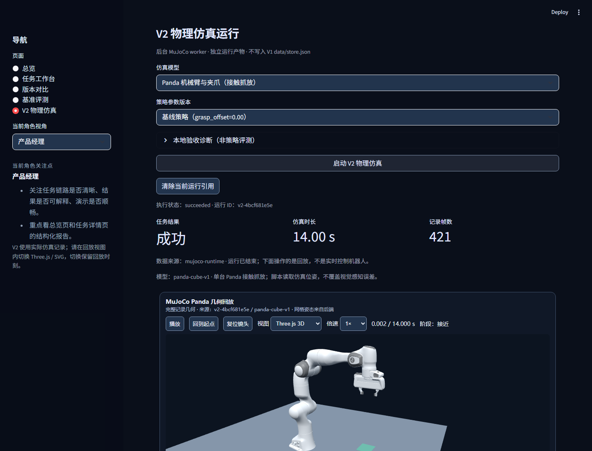

# RoboForge

本地运行的机械臂任务验证工具：使用 MuJoCo 执行 Panda 机械臂与双指夹爪的方块抓取任务，回放真实仿真轨迹，查看任务结果和运行证据，并比较两组受控参数。

它适合用来演示和检查机器人任务验证流程，不是实时遥操作系统、视觉模型训练平台，也不代表真机控制或 sim-to-real 能力。



## 能做什么

- 运行 Panda 机械臂的单方块抓取与放置任务
- 使用 MuJoCo 产生带机械臂、夹爪和物体状态的仿真记录
- 在浏览器页面中回放轨迹、查看任务阶段和时间轴
- 保存每次运行的参数、模型身份、状态、事件和结果
- 查看运行历史，区分成功、失败、异常和无法确认的记录
- 比较 `baseline` 与 `offset-grasp` 等受控参数方案
- 在 WebGL 不可用时提供明确标记的简化视图

当前范围是单机、单 Panda、单方块抓放。前端回放后端已经生成的记录，不实时控制机器人。

## 快速开始

### 环境

- Python 3.10 或更高版本
- Node.js 18 或更高版本（构建完整 3D 回放时需要）
- Windows、macOS 或 Linux

### 安装

```bash
git clone https://github.com/K0848/robot-task-verification-mvp.git
cd robot-task-verification-mvp

python -m venv .venv
```

Windows PowerShell：

```powershell
.\.venv\Scripts\Activate.ps1
python -m pip install -r requirements.txt
```

macOS / Linux：

```bash
source .venv/bin/activate
python -m pip install -r requirements.txt
```

### 构建 3D 回放并启动

```bash
npm ci --prefix web/robot_renderer
npm run build --prefix web/robot_renderer
python -m streamlit run app.py
```

然后打开 Streamlit 显示的本地地址，进入“验证工作台”，选择参数方案并点击“开始验证”。完成后可以在页面中查看回放、运行结果和证据；“运行记录”页面用于查找历史运行。

Windows 用户也可以直接运行：

```text
start.bat
```

`start.bat` 会安装 Python 依赖并启动页面。若需要完整 Panda 3D 回放，仍需先执行上面的 Node.js 构建命令。

模型资产已经随仓库提供。只有在本地资产缺失时才需要执行：

```bash
python scripts/fetch_panda_assets.py
```

## 命令行运行

生成一次 Panda 仿真运行：

```bash
python -m robot_mvp.v2_cli run --model panda-cube-v1 --strategy baseline --timeout 30
```

生成另一组抓取偏移参数：

```bash
python -m robot_mvp.v2_cli run --model panda-cube-v1 --strategy offset-grasp --grasp-offset 0.08 --timeout 30
```

比较两次运行：

```bash
python -m robot_mvp.v2_cli compare data/v2_runs/<run-a> data/v2_runs/<run-b>
```

查询运行记录：

```bash
python -m robot_mvp.v2_cli list --limit 20 --offset 0
python -m robot_mvp.v2_cli show <run-id>
python -m robot_mvp.v2_cli overview
```

运行产物保存在 `data/v2_runs/`。运行异常、损坏记录和证据不足的记录不会被自动当作成功。

## 测试

运行 Python 测试：

```bash
python -m unittest discover -s tests -v
```

运行前端类型检查、测试和构建：

```bash
npm run check --prefix web/robot_renderer
npm test --prefix web/robot_renderer
npm run build --prefix web/robot_renderer
```

## 项目结构

```text
.
├── app.py                         # Streamlit 页面入口
├── robot_mvp/                     # 仿真运行、结果记录和页面数据适配
├── web/robot_renderer/            # Three.js 轨迹回放前端
├── assets/robots/panda/           # Panda 机械臂与夹爪模型
├── scripts/                       # 资产检查和验证脚本
├── tests/                         # Python 与前端测试
├── data/v2_runs/                  # 本地运行产物
└── requirements.txt               # Python 依赖
```

## 当前限制

- 只有 Panda 单机械臂、单方块抓取放置任务
- 使用脚本策略，不包含 VLA、视觉感知、策略训练或遥操作
- 仿真结果不等于真实机器人表现，不能直接用于真机安全或生产验收
- 当前前端是仿真记录回放，不是实时机器人控制界面
- WebGL 不可用时会回退到简化视图；简化视图不代表完整机械臂几何回放通过
- 运行结果只对当前模型、场景、参数和仿真环境负责，不代表泛化能力

## 模型来源

仓库中的 Panda 模型资产来源、文件清单和许可证见 [`assets/robots/panda/README.md`](assets/robots/panda/README.md)、[`assets/robots/panda/LICENSE`](assets/robots/panda/LICENSE) 和 [`assets/robots/panda/SOURCES.json`](assets/robots/panda/SOURCES.json)。

请分别遵守项目代码和上游模型资产适用的许可条件，不要将上游 Panda 模型宣称为自研资产。
