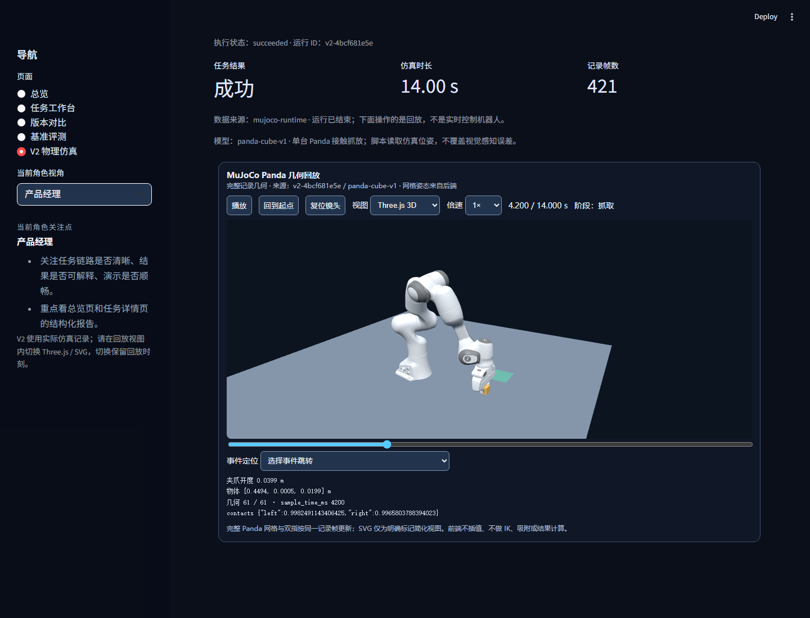
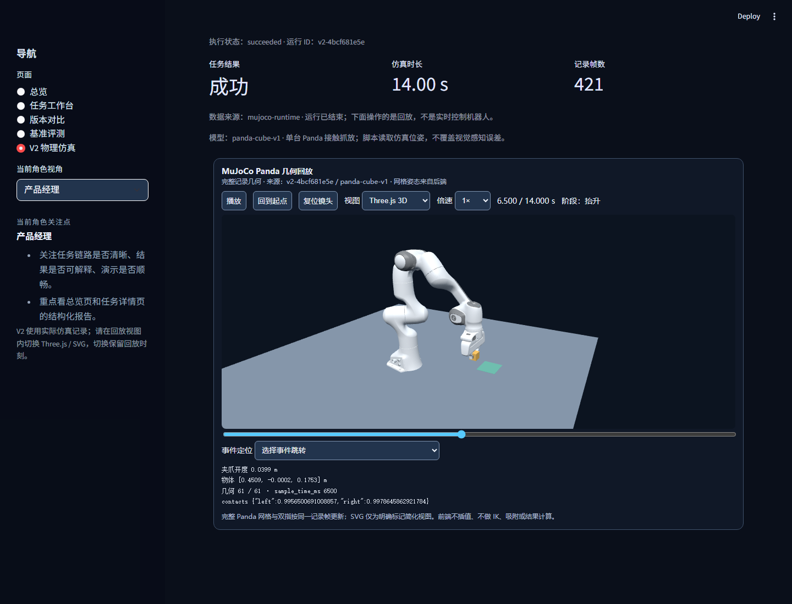
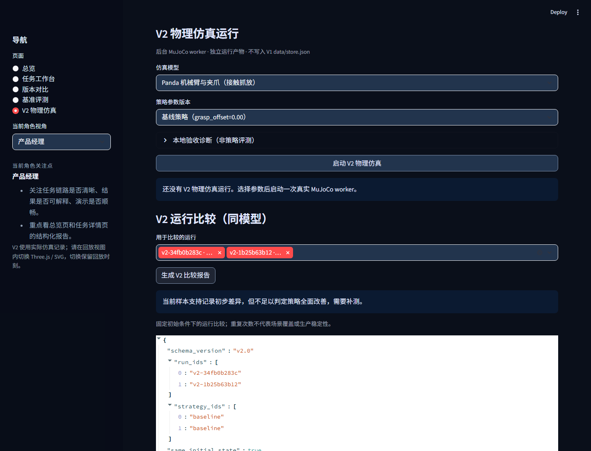
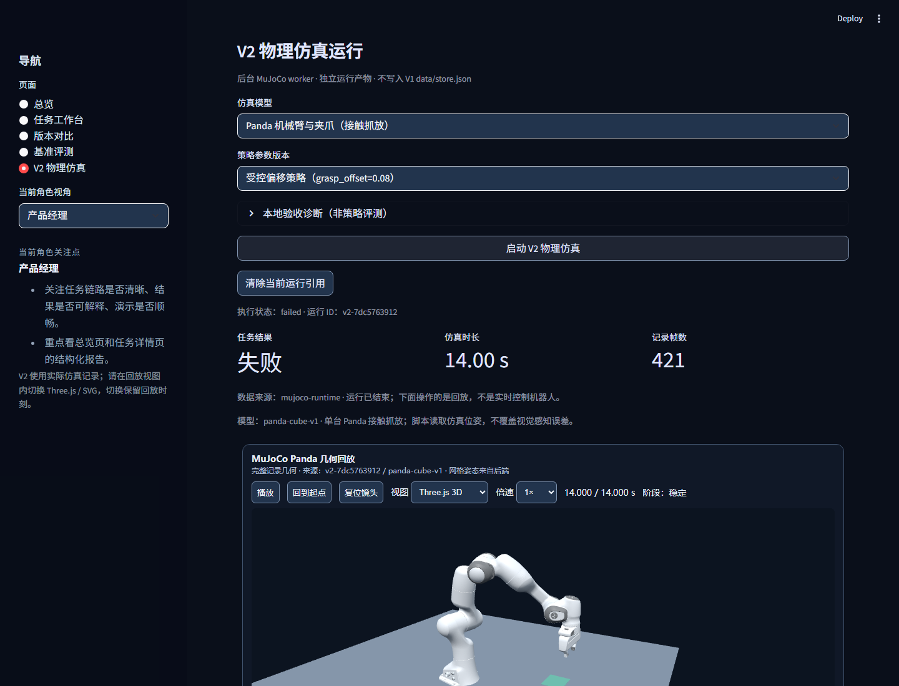
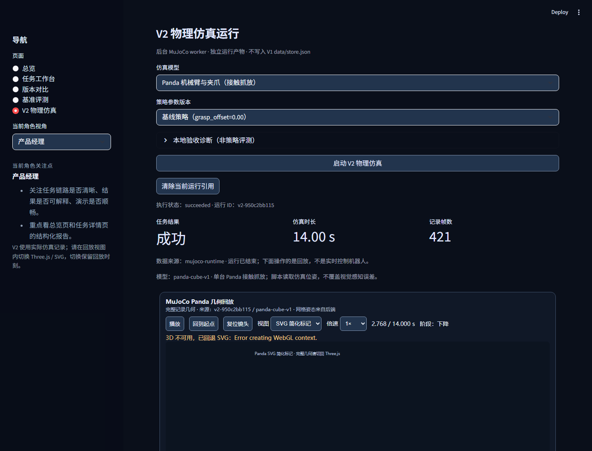
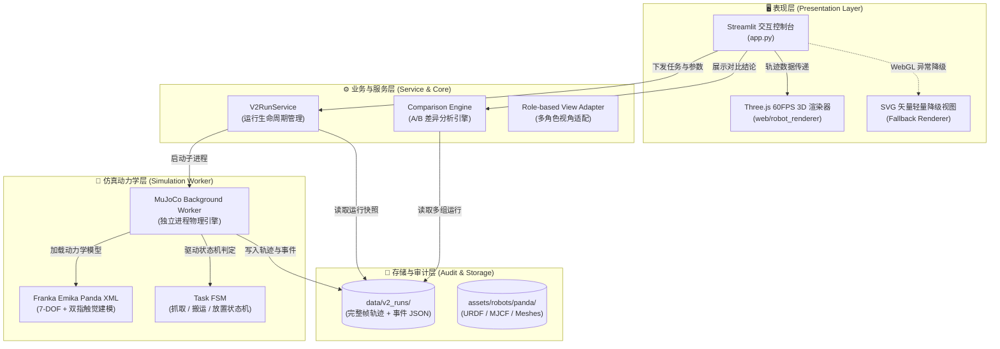

<div align="center">

# 🦾 RoboForge

### 具身智能机械臂任务验证工作台 · 本地仿真与交互式回放系统

> *「仿真。回放。一份可审计的具身任务验证报告。」*  
> *"Simulate. Replay. Deliver an auditable robotic verification report."*

[](LICENSE)
[](https://www.python.org/)
[](https://mujoco.org/)
[](https://threejs.org/)
[](https://streamlit.io/)
[](https://franka.de/)
[](tests/)

<br>

**专为具身智能（Embodied AI）打造的本地任务验证与评测工作台。**  
告别算法黑盒与真机炸机风险，让每一次机械臂策略优化都「看得见、测得准、交得出」。

<br>

```bash
# Windows 用户双击即可秒级启动
start.bat
```

[✨ 核心特性](#-核心特性) · [🎬 Demo 画廊](#-demo-画廊) · [⚡ 快速上手](#-30秒快速上手) · [📊 能力矩阵](#-能力矩阵) · [👥 角色协同](#-多角色协同视角) · [🏗️ 架构设计](#️-系统架构与数据流) · [🎯 产品思考与边界](#-产品思考与设计边界)

</div>

---

<p align="center">
  
</p>

<p align="center"><sub>
  ▲ <b>RoboForge 核心工作台</b>：Franka Emika Panda 7-DOF 机械臂在 MuJoCo 真实接触动力学下抓取方块，Three.js 60FPS 逐帧回放与双指触觉反馈实时遥测。<br>
  👉 仓库内置高清演示实录：<a href="demo.mp4">本地下载查看 demo.mp4</a>
</sub></p>

---

## 💡 为什么需要 RoboForge？

在机器人与具身智能（Embodied AI）产品落地过程中，算法与工程团队常常陷入四大困境：

| 传统痛点场景 | 传统做法的代价 | 🦾 RoboForge 破局方案 |
|:---|:---|:---|
| **真机测试门槛高** | 每次策略微调就直接上真机，硬件磨损大，碰撞炸机成本极高 | **本地 MuJoCo 动力学验证**：接触力学、刚体碰撞毫秒级高精度解算，零硬件损耗安全试错 |
| **仿真过程黑盒化** | 终端只有冰冷的数字坐标与 log，算法、测试与业务沟通像“盲人摸象” | **交互式 60FPS Three.js 回放**：时间轴拖拽、多视角观察、夹爪开度与触点力分布实时可视化 |
| **策略迭代难量化** | 缺乏标准基准，改了抓取偏置到底是“变好了”还是“偶然跑通”无法定论 | **受控 A/B 策略评测**：`baseline` 与 `offset-grasp` 等参数方案并排差分，指标一键对比 |
| **演示与跨端容灾差** | 汇报时 WebGL 崩溃直接白屏，缺少完整证据链支撑验收 | **可信证据链 + 双重容灾**：全生命周期 JSON 台账持久化，WebGL 异常自动无缝降级为 SVG 矢量视图 |

---

## ✨ 核心特性

- 🦾 **真实物理动力学驱动**：集成 Google DeepMind MuJoCo 物理引擎，真实还原 Franka Emika Panda 机械臂连杆质量分布、关节力矩限位、双指夹爪摩擦力与方块刚体接触。
- 🎮 **现代 Web 3D 交互回放**：基于 Three.js 开发的轻量级前端渲染器，支持 60FPS 帧级回放、倍速调节、阶段跳转（抓取/搬运/放置）、视角旋转缩放与触觉接触力实时投影。
- ⚖️ **受控 A/B 策略评测引擎**：一键生成基线策略（Baseline）与抓取偏移策略（Offset Grasp）的并排对比报告，量化成功率、任务耗时、轨迹平滑度与终端偏差。
- 📋 **可信证据链与全生命周期台账**：每次运行均自动捕获模型身份、策略参数、状态机事件（Events）、物理量曲线与结果断言，异常与超时精准归因。
- 👥 **独创多角色协同视图**：内置针对「产品经理」、「算法工程师」、「测试/实施」的三种专属关注点视角，打通跨部门任务验收语言。
- 🛡️ **双渲染引擎弹性容灾**：当客户机不支持 WebGL 或显存 Context Lost 时，系统自动回退至轻量 SVG 空间投影轨迹视图，确保演示与验证流程 100% 不中断。

---

## 🎬 Demo 画廊

### 1. Panda 机械臂高保真抓取与搬运全过程

> **真实的接触力学解算**：双指夹爪贴合方块表面，接触力传感器实时触发，方块受摩擦力随机械臂抬升并精准转移至目标区域。

<p align="center">
  
  
</p>
<p align="center"><sub>左：抓取接触临界状态（4.20s · 夹爪闭合） · 右：平稳搬运与空间位姿跟随（6.50s · 搬运阶段）</sub></p>

---

### 2. 受控 A/B 策略版本对比（A/B Comparison）

> **量化每一处参数改动的实际价值**：选择两次运行记录，系统自动对齐初始条件，并排比对抓取耗时、轨迹发散度与最终成功状态，给出结构化差分评测报告。

<p align="center">
  
</p>
<p align="center"><sub>▲ 同一场景下两组策略的量化差分对比与审计判定</sub></p>

---

### 3. 故障归因与可解释性诊断（Failure Diagnosis）

> **不仅记录成功，更穿透失败原因**：当抓取偏置超出物理稳定边界（如 `offset-grasp=0.08`），系统精准捕获夹爪滑脱、方块掉落与超时未就位事件，绝不将异常数据混入合格基准。

<p align="center">
  
</p>
<p align="center"><sub>▲ 抓取失败状态断言、事件时间线与异常原因精准溯源</sub></p>

---

### 4. 工业级容灾：WebGL 异常自动无缝降级

> **高可用性保障**：在无独立显卡服务器、远程容器或 WebGL Context 丢失的极端场景下，界面清晰提示并无缝切换至 2D/3D SVG 矢量轨迹视图，数据不丢、回放不停。

<p align="center">
  
</p>
<p align="center"><sub>▲ 优雅降级机制：明确标记的 SVG 投影简化视图，保障极端环境下的可审查性</sub></p>

---

## 📊 能力矩阵

| 功能模块 | 核心能力 | 交付产物 / 可视化形态 | 解决的产品与工程问题 |
|:---|:---|:---|:---|
| **物理仿真运行器** | MuJoCo 后台独立 Worker 执行，解算 7-DOF 运动学与接触动力学 | 规范化 `v2_runs` 数据包、关键帧轨迹序列 | 摆脱仿真与 UI 线程锁死，保障物理仿真高实时性与精度 |
| **交互式 3D 工作台** | Three.js WebGL 渲染、时间轴滑块、相机多视角自由巡检 | 60FPS 平滑 3D 机械臂仿真回放、事件标记轴 | 将抽象的数字物理日志转化为具象的三维作业全貌 |
| **A/B 评测套件** | 受控参数配置（初始位姿、抓取偏置、超时阈值等）、差分计算 | 并排指标对比大盘、成功率/耗时对比雷达图 | 解决策略迭代“效果凭感觉”的难题，提供量化发版依据 |
| **任务证据库与审计** | 状态机自动校验、全要素 JSON 存储、防篡改元数据 | 审计级任务报告、故障断言追踪记录 | 满足具身智能任务验证可溯源、可复现、可交付的合规需求 |
| **角色协同看板** | 预置「产品经理 / 算法工程师 / 测试实施」3 种视角提示与过滤 | 角色定制化报表看板与差异化重点聚焦 | 打破研发、测试与产品经理之间的沟通壁垒，对齐验收标准 |

---

## 👥 多角色协同视角

RoboForge 不只是算法的游乐场，更是产品、算法与测试团队的**统一任务验收中心**：

```
                ┌──────────────────────────────────────┐
                │          RoboForge 协同中心          │
                └──────────────────┬───────────────────┘
                                   │
         ┌─────────────────────────┼─────────────────────────┐
         ▼                         ▼                         ▼
   👔 产品经理 (PM)          🧠 算法工程师 (Algo)       🛠️ 测试/实施 (QA)
  ─────────────────         ───────────────────       ──────────────────
  • 验收链路是否闭环         • 观察抓取偏置临界界限    • 帧级复现偶发故障路径
  • 评估任务耗时与效率       • 分析接触力分布与滑动    • 验证超时/越界熔断保护
  • 导出结构化业务报告       • 快速调参验证新策略      • 检查无显卡环境降级容灾
```

---

## ⚡ 30秒快速上手

### 环境准备

- **Python** 3.10 或更高版本
- **Node.js** 18 或更高版本（用于构建 Three.js 3D 轨迹渲染器）
- 操作系统支持：Windows、macOS、Linux

### 极速启动（Windows）

仓库已内置 Windows 一键启动脚本，双击或在终端中运行：

```cmd
start.bat
```

> `start.bat` 会自动检测 Python 依赖并启动 Streamlit 工作台。

---

### 标准手动部署（跨平台）

1. **克隆代码库**

```bash
git clone https://github.com/K0848/robot-task-verification-mvp.git
cd robot-task-verification-mvp
```

2. **初始化 Python 虚拟环境并安装依赖**

```bash
python -m venv .venv

# Windows PowerShell:
.\.venv\Scripts\Activate.ps1
# macOS / Linux:
source .venv/bin/activate

python -m pip install --upgrade pip
python -m pip install -r requirements.txt
```

3. **编译 3D WebGL 渲染组件并启动**

```bash
# 编译 Three.js 渲染前端组件
npm ci --prefix web/robot_renderer
npm run build --prefix web/robot_renderer

# 启动 Streamlit 工作台
python -m streamlit run app.py
```

启动后，浏览器将自动打开本地地址（默认 `http://localhost:8501`）。进入 **“V2 物理仿真”** 页面，选择策略方案并点击 **“启动 V2 物理仿真”**，即可开始体验！

*(注：Panda 模型网格资产已内置在仓库中。如本地资产缺失，可运行 `python scripts/fetch_panda_assets.py` 自动补全)*

---

## 💻 命令行极客模式 (CLI)

RoboForge 提供了全功能的 Headless 命令行工具，方便集成至 CI/CD 流水线或进行批处理验证：

```bash
# 1. 运行一次标准基线抓取仿真任务
python -m robot_mvp.v2_cli run --model panda-cube-v1 --strategy baseline --timeout 30

# 2. 注入 0.08m 抓取偏置，运行对照组仿真
python -m robot_mvp.v2_cli run --model panda-cube-v1 --strategy offset-grasp --grasp-offset 0.08 --timeout 30

# 3. 命令行一键差分对比两次仿真记录
python -m robot_mvp.v2_cli compare data/v2_runs/<run-id-a> data/v2_runs/<run-id-b>

# 4. 检索、展示与概览全部历史仿真台账
python -m robot_mvp.v2_cli list --limit 20
python -m robot_mvp.v2_cli show <run-id>
python -m robot_mvp.v2_cli overview
```

---

## 🏗️ 系统架构与数据流



---

## 🧪 自动化测试与工程质量

项目具有完整的全栈单元测试与类型安全保障体系：

```bash
# 运行 Python 核心业务逻辑与物理接口测试 (30+ 自动化用例)
python -m unittest discover -s tests -v

# 运行前端组件类型检查、测试与静态构建
npm run check --prefix web/robot_renderer
npm test --prefix web/robot_renderer
npm run build --prefix web/robot_renderer
```


---

## 🎯 产品思考与设计边界

> 💡 **产品经理笔记**：好的工具不仅在于宣称能做什么，更在于极其诚实地定义自身边界。

- **定位聚焦**：RoboForge 聚焦于机器人任务的**“本地轻量化验证与对比评测”**，帮助算法、产品与测试在策略提交前建立确定性信心。
- **仿真 vs 真机**：当前系统基于 MuJoCo 动力学仿真，旨在快速验证逻辑闭环与受控参数稳健性；仿真结论**不等同于**真机 Sim-to-Real 表现，严禁未经实物标定直接用于生产安全验收。
- **无黑盒大模型绑架**：当前抓放策略采用脚本化状态机引导，确保每一次失败和成功都具备 100% 的因果可解释性与复现性。
- **真实记录，严禁粉饰**：前端仅对已生成的真实仿真轨迹做可视化回放，不篡改物理数据，不进行前台吸附伪造，失败即如实呈现失败。

---

## 📜 许可证与资产来源

- **项目代码**：采用 [MIT License](LICENSE) 开源许可证。
- **Panda 机械臂模型资产**：来源于开源生态整理，完整清单、来源追溯与原许可证详见 [`assets/robots/panda/README.md`](assets/robots/panda/README.md) 与 [`assets/robots/panda/SOURCES.json`](assets/robots/panda/SOURCES.json)。请遵守上游资产许可，勿将第三方模型声明为自研资产。

---

<div align="center">

**如果这个项目对你的具身智能研发或产品设计有所启发，欢迎点个 ⭐️ Star 支持一下！**  
欢迎提交 Issue 与 PR 共同完善具身智能任务验证基础设施。

</div>
