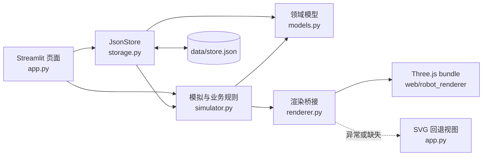
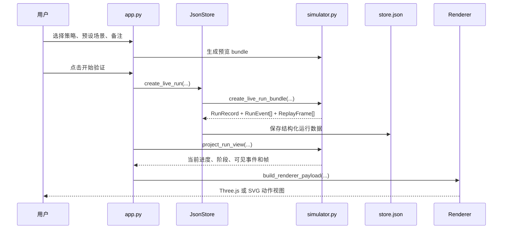
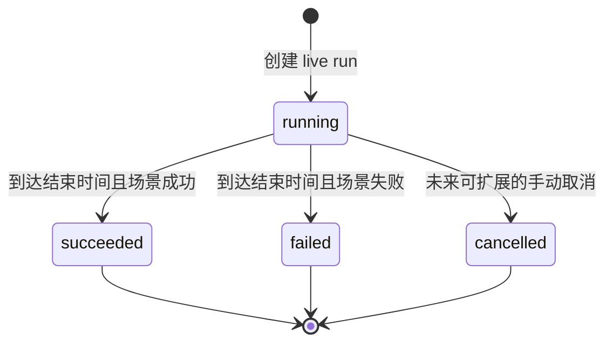
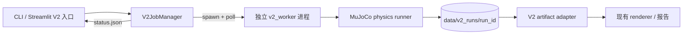

# 系统架构

> 版本 v2.0 · 2026-09-22

> 本文记录当前实现。V1/旧平面 V2 保留；Panda 完整机械臂增量见第 8 节，实际放行状态见 [实施门禁](Panda实施与门禁.md)。实现存在不等于验收已通过。

## 1. 架构目标与边界

系统为本地单用户演示提供一条可重复的机器人任务验证闭环。它把“业务运行事实”和“动作展示”分开：Python 生成并解释运行数据，Three.js 负责把已定义的数据变成动作视图。

当前系统的确定性来源是 Python 模拟器和 JSON 数据；浏览器渲染只负责表现，不负责改变任务结果、失败原因或评测结论。

当前边界：

- 单机、本地、模拟数据、单一 Pick & Place 任务模板；
- JSON 文件作为唯一持久化介质；
- Streamlit 负责页面和交互编排；
- Three.js bundle 缺失或渲染异常时，SVG 视图继续提供核心展示；
- 不承诺真实机械臂控制、实时传感器采集、并发任务和线上可靠性。

V2 增加一个与上述 V1 数据域隔离的执行边界：原生 MuJoCo worker 产生独立运行产物，V1 `data/store.json` 仍只承载历史演示数据。V2 的“实时”是状态文件轮询，不是 Streamlit 进程内步进动力学。

## 2. 逻辑架构

## 3. 模块职责与数据所有权

| 模块 | 负责 | 不负责 | 主要输出 |
|---|---|---|---|
| `app.py` | 页面布局、控件、导航、Session 状态、展示编排 | 重新推断运行结果和业务规则 | 页面、用户操作、渲染调用 |
| `robot_mvp/models.py` | 领域对象和 JSON 序列化/反序列化 | 业务决策、页面展示 | `StoreData` 及其子对象 |
| `robot_mvp/simulator.py` | 场景规则、运行生成、事件/帧、状态投影、对比、评测、渲染载荷 | 文件读写、浏览器 DOM | 运行对象、派生视图、摘要、payload |
| `robot_mvp/storage.py` | 初始化、加载、保存、创建运行和评测批次 | 页面状态、渲染细节 | `store.json` 的一致读写 |
| `robot_mvp/renderer.py` | payload 序列化、bundle 注入、渲染失败回退 | 修改领域数据 | 浏览器内动作视图 |
| `web/robot_renderer` | 帧采样、插值、Three.js 场景和镜头 | 生成业务结论、写入 JSON | 2.5D 动作场景 |

数据所有权遵循一条规则：运行结果、失败原因、阶段和评测结论由 Python 侧生成；前端只消费 `RendererPayload`，不能把视觉状态反写成业务结果。

## 4. 关键数据流

### 4.1 单次任务

### 4.2 基准评测

基准评测复用单次运行的数据模型。`create_benchmark_batch()` 遍历套件用例，为每个用例生成一条 `RunRecord`，然后由 `summarize_benchmark_batch()` 汇总成功率、耗时、失败分布和最弱案例。

### 4.3 运行状态

当前代码以时间投影判断运行中的展示状态；应用每次加载时会同步已经到期的运行。暂停是 UI 层的运行时控制，用于冻结投影时间，不改变已持久化的任务事实。

## 6. V2 执行架构

V2 模块职责：`V2JobManager` 只拥有进程生命周期和超时/崩溃转换；`v2_worker` 只拥有单次物理执行；`v2_physics` 只拥有 MuJoCo 状态、成功阈值和事件；`ArtifactStore` 只读写运行目录；`v2_adapter` 只把真实轨迹转换为既有展示协议。任何模块都不能把 V2 运行结果写入 V1 `store.json`。

V2 可视化使用 `v2_view.py` 和同一前端 bundle 中独立的 `physical.ts` 入口。worker 状态与浏览器回放时间分别归属后端和前端，不以回放进度判断任务成功。终态之后不再轮询重建回放；Three.js/SVG 共用物理帧采样。V1 的示意机械臂、snap 和像素投影不进入 V2 路径。

## 5. 渲染边界与降级

`build_renderer_payload()` 是 Python 与 TypeScript 之间的唯一业务渲染边界。它携带状态、阶段、场景、动态配置、动画参数、事件和回放帧。

渲染策略：

1. `renderer.js` 存在且浏览器执行成功时使用 Three.js；
2. bundle 缺失时，应用直接使用 SVG；
3. bundle 存在但浏览器执行失败时，渲染桥接隐藏 Three.js 容器并显示 SVG，同时保留失败提示；
4. 任何渲染失败都不能修改 `RunRecord.result` 或评测摘要。

## 7. 当前架构风险与迭代边界

| 风险 | 当前影响 | 进入下一阶段的条件 |
|---|---|---|
| JSON 单文件写入 | 适合单机演示，不适合并发和大数据量 | 明确用户、并发和数据规模后再替换存储层 |
| 模拟器同时承担场景和评测规则 | MVP 易读，策略/场景增多后会变重 | 引入真实数据源前先拆分场景定义、运行适配和评测规则 |
| `input_params` 是开放字典 | 迭代灵活，但字段约束不集中 | 稳定字段达到跨页面复用后，提升为版本化 schema |
| 浏览器渲染未做端到端验收 | 单测能证明协议逻辑，不能证明实际页面表现 | 每次动作视图改动增加一次真实 Streamlit 浏览器验收 |
| Windows 并发读写 status.json | 父进程轮询可能与 worker 原子替换短暂冲突 | worker 重试原子替换，读取端对短暂锁和半写入重试；仍只支持单机单用户 |
| 轻量平面模型不是高保真机械臂 | 只能证明执行、产物和评测链路 | README、报告和面试表达明确限制，不外推到 sim-to-real |

后续迭代应先确定产品是否仍保持“作品集 MVP”定位；如果要接入真实机器人或多人协作，需要重新评估数据采集、权限、并发、可靠性和部署架构，不能只在当前模拟器上叠加入口。

## 8. Panda 完整模型增量

- `panda_model.py`：固定资产来源/清单指纹和每文件哈希；以 Python 读取网格进入 MuJoCo 虚拟文件系统，避免 Windows 中文路径限制。拥有场景、判据和目标关节角求解，不在前端计算机器人动作。
- `panda_runner.py`：只通过控制量驱动机器人，双指与物体通过接触/摩擦作用；每物理步核验抬升、释放与稳定窗口。导出同一编译模型的可视网格、几何世界姿态和状态轨迹，不引入工具—物体 weld。
- `v2_physics.py`：按 `model_id` 分派旧平面和 Panda；`v2_runtime.py` 拥有启动前配置检查、墙钟超时、终态进程回收和可比性检查；worker 先落盘错误日志再发布失败终态。
- `panda_artifacts.py`：Panda v2.1 的数据边界校验；`v2_adapter.py` 将验证后的产物转为 `robot_scene` / `robot_frames`，旧帧字段仅用于同刻的简化视图。旧 v2.0 不生成虚假关节。
- `v2_view.py`：报告与回放分别读取；损坏轨迹/场景显示不可验证提示，不掩盖独立有效报告。页面默认选择 Panda，保留显式历史平面入口。同模型比较在独立 Streamlit fragment 中运行，避免查看比较时重建播放器。
- `robot-scene.ts` / `physical.ts`：从编译网格和逐帧世界姿态显示完整模型，整体坐标转换为 Three.js；播放器选取真实记录帧，不插值部件或吸附物体；业务结论仍由后端拥有。无 WebGL 时只提供明确标记的有限示意，不视为完整模型放行。

资产在本地固定，日常运行不联网获取。模型/场景/评估或初始条件不一致不能作为受控优劣比较；固定条件重复仅说明重复性。首版单用户单任务，不宣称多浏览器会话的并发调度能力。完整数据字段和异常行为见接口契约第 13 节。

## 9. 运行业务服务与前端承接

`V2RunService`位于现有页面/CLI与JobManager/ArtifactStore之间，集中负责模型/参数目录、历史运行查询、默认比较建议和可信统计。页面不再自行扫描目录、吞掉异常或硬编码偏移参数；它只将用户选择交给服务并展示返回状态。

ArtifactStore对读写入口统一解析安全run ID与目录边界。报告语义校验由后端`validate_summary`集中提供，页面、记录查询和比较共用；完整几何/轨迹仍由原artifact adapter及Panda校验器处理。没有更改MuJoCo控制或成功判据。

比较基于实际参数而非显示名称，并区分重复性检查和受控参数比较。查询与结果查看不依赖会话中的进程句柄；进程启动/等待/超时继续使用既有JobManager，文件查询不承担未知进程接管。列表只轻量校验，统计和实际比较再次完整校验。

下一前端阶段可以据此组织“验证工作台/运行记录”和历史演示入口。本次未改主导航、角色选择或播放器视觉，不将后端完成误记为前端信息架构已完成。
